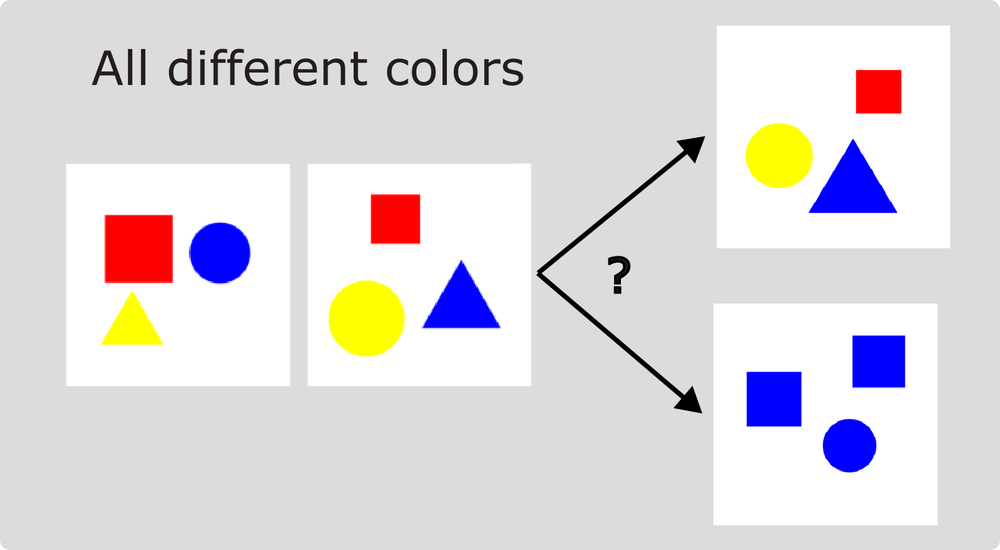
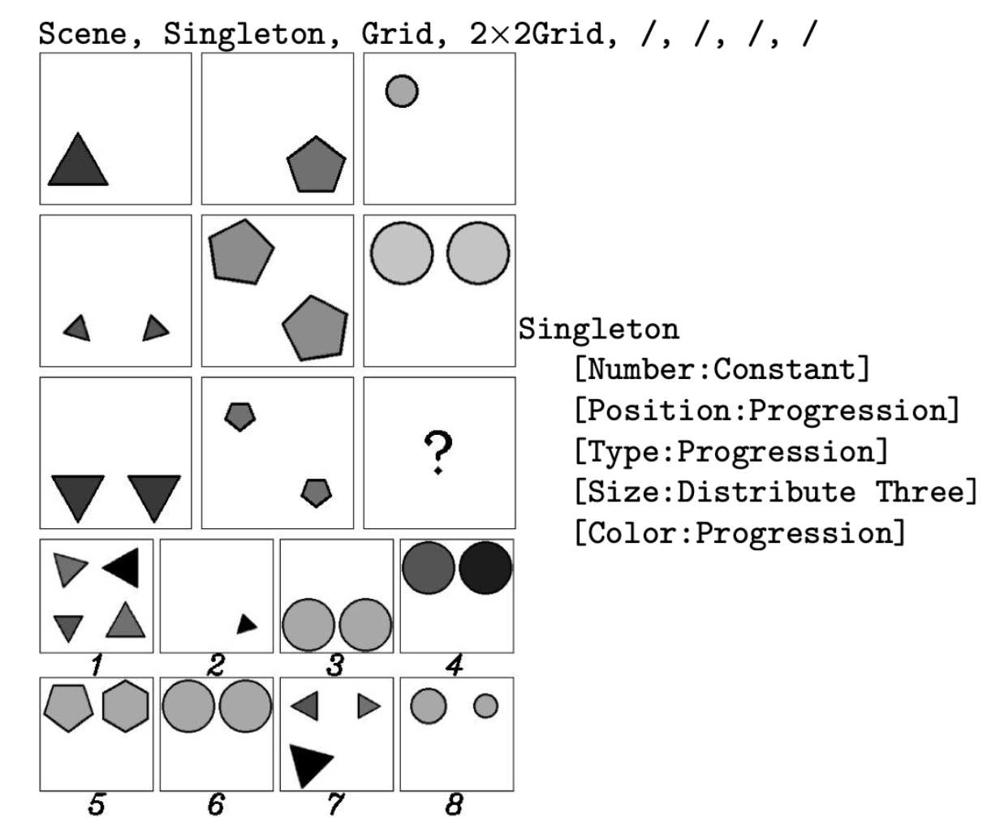

# Evaluate models on "A Benchmark Suite for Systematically Evaluating Reasoning Shortcuts"

## Installation and Usage

To run experiments on MNIST-Addition, Kandinsky, BDD-OIA, and SDD-OIA, access your Linux terminal and follow these steps for conda installation followed by pip:

```bash
conda env create -n rs python=3.8
conda activate rs
pip install -r requirements.txt
```

We recommend using `Python 3.8`, though newer versions should also be compatible.

## BDD-OIA (2048)

BDD-OIA is a dataset containing dashcam images for autonomous driving predictions. It includes annotations for input-level objects (such as bounding boxes for pedestrians) and concept-level entities (like "road is clear"). The original dataset can be found [here](https://twizwei.github.io/bddoia_project/).

The dataset has been preprocessed using a pretrained Faster-RCNN on BDD-100k and the initial module from CBM-AUC (Sawada and Nakamura, IEEE 2022), resulting in embeddings of dimension 2048. These embeddings are provided in the `bdd_2048.zip` file. The original CBM-AUC repository is available [here](https://github.com/AISIN-TRC/CBM-AUC).


When using this dataset, please consider citing the original dataset creators and Sawada and Nakamura.

```
@InProceedings{xu2020cvpr,
author = {Xu, Yiran and Yang, Xiaoyin and Gong, Lihang and Lin, Hsuan-Chu and Wu, Tz-Ying and Li, Yunsheng and Vasconcelos, Nuno},
title = {Explainable Object-Induced Action Decision for Autonomous Vehicles},
booktitle = {IEEE/CVF Conference on Computer Vision and Pattern Recognition (CVPR)},
month = {June},
year = {2020}}

@ARTICLE{sawada2022cbm-auc,
  author={Sawada, Yoshihide and Nakamura, Keigo},
  journal={IEEE Access}, 
  title={Concept Bottleneck Model With Additional Unsupervised Concepts}, 
  year={2022},
  volume={10},
  number={},
  pages={41758-41765},
  doi={10.1109/ACCESS.2022.3167702}}
```

## SDD-OIA

SDD-OIA is a synthetic dataset generated using `Blender`. This synthetic data is inspired by `BDD-OIA` and mimics images taken from car dashcams. The concept-level annotations are similar to those in `BDD-OIA`, but the knowledge and object distributions in the scene are fully customizable. For further information, please refer to the paper or the data generation repository.


## MNIST

This repository includes several MNIST variations. The most notable ones are:

**MNIST-Even-Odd:**

The MNIST-Even-Odd dataset is a variant of MNIST-Addition introduced by [Marconato et al. (2023b)](https://proceedings.mlr.press/v202/marconato23a/marconato23a.pdf). It includes specific combinations of digits, featuring only even or odd digits, such as 0+6=6, 2+8=10, and 1+5=6. The dataset contains 6,720 fully annotated samples in the training set, 1,920 samples in the validation set, and 960 samples in the in-distribution test set. Additionally, there are 5,040 samples in the out-of-distribution test set, covering sums not observed during training. This dataset is associated with reasoning shortcuts, and the number of deterministic RSs was calculated to be 49 by solving a linear system.

**MNIST-Half:**

MNIST-Half is a biased version of MNIST-Addition introduced in [Marconato et al. (2024)](https://arxiv.org/pdf/2402.12240), focusing on digits from 0 to 4. It includes digit combinations like 0+0=0, 0+1=1, 2+3=5, and 2+4=6. Unlike MNIST-Even-Odd, two digits (0 and 1) are not influenced by reasoning shortcuts, while digits 2, 3, and 4 can be predicted differently. The dataset consists of 2,940 fully annotated samples in the training set, 840 samples in the validation set, and 420 samples in the test set. Additionally, there are 1,080 samples in the out-of-distribution test set, covering remaining sums with the included digits.

## Kandinsky

The Kandinsky dataset, introduced by Müller and Holzinger in 2021, features visual patterns inspired by the works of Wassily Kandinsky. Each pattern is constructed with geometric figures and includes two main concepts: shape and color. This dataset offers a variant where each image contains a fixed number of figures, each with one of three possible colors (red, blue, yellow) and one of three possible shapes (square, circle, triangle).

In this setting, which is the same as the one presented in [Marconato et al. (2024)](https://arxiv.org/pdf/2402.12240), the task involves predicting the pattern of a third image given two images that share a common pattern. During inference, a model, such as the NeSy model mentioned in the experiments, computes a series of predicates like "same_cs" (same color and shape) and "same_ss" (same shape and same color). The model needs to select the third image that completes the pattern based on these computed predicates. For example, if the first two images have different colors, the model should choose the option that aligns with the observed pattern. This dataset presents a challenging task that tests a model's ability to generalize and infer relationships between visual elements.



## RAVEN

This branch adds a reasoning-shortcut task based on the RAVEN dataset,
introduced by [Zhang et al. (2019)](https://arxiv.org/abs/1903.02741). RAVEN is
a computer-vision dataset inspired by John C. Raven's original 1938 Raven's
Progressive Matrices (RPM) test, a non-verbal assessment of abstract reasoning.
The dataset name is an homage to Raven; its purpose is to evaluate structural,
relational, and analogical visual reasoning.

An RPM problem contains a 3 by 3 matrix of grayscale panels: the first eight
panels form the context, the bottom-right panel is missing, and the model must
select the candidate that completes the matrix. Each RAVEN problem therefore
contains 16 panels: eight context panels and eight answer candidates, with a
target index from `0` through `7`.



*Example from [Zhang et al.'s RAVEN paper](https://openaccess.thecvf.com/content_CVPR_2019/html/Zhang_RAVEN_A_Dataset_for_Relational_and_Analogical_Visual_REasoNing_CVPR_2019_paper.html): the upper matrix is the context and the lower panels are the answer candidates.*

The current implementation supports the reduced `center_single`
configuration. Every panel contains one centered object, and the model reasons
over three rule-governed attributes: **Type**, **Size**, and **Color**.
`ravendpl` combines a shared panel encoder with factorized DeepProbLog
reasoning, scoring the candidate that is consistent with the rules inferred
from the first two rows.

### Dataset layout

RAVEN data is not included in the repository. The reduced datasets are
generated with a modified RAVEN generator, available at
[jucamohedano/RAVEN](https://github.com/jucamohedano/RAVEN) (a fork of
[WellyZhang/RAVEN](https://github.com/WellyZhang/RAVEN)):

- branch [`raven-3x3x3`](https://github.com/jucamohedano/RAVEN/tree/raven-3x3x3)
  (commit `65c6ba9`) for the three-value dataset;
- branch [`raven-4x4x4`](https://github.com/jucamohedano/RAVEN/tree/raven-4x4x4)
  (commit `8fd5eb8`) for the four-value dataset.

Each branch README documents the reduced attribute domains. From the desired
branch, generate the dataset with the generator's Python 2.7 environment:

```sh
python src/dataset/main.py --num-samples 5000 --save-dir <output>/RAVEN-3x3x3
```

The defaults (`--val 2 --test 2 --seed 1234`) produce a 6:2:2 split of
3000 train / 1000 val / 1000 test samples. Use `--save-dir
<output>/RAVEN-4x4x4` on the `raven-4x4x4` branch for the four-value
dataset. Then place the generated `.npz` panel data and matching `.xml`
metadata files under `rss/data`. The default three-value dataset is expected at:

```text
rss/data/RAVEN-3x3x3/center_single/
  RAVEN_*_train.npz
  RAVEN_*_train.xml
  RAVEN_*_val.npz
  RAVEN_*_val.xml
  RAVEN_*_test.npz
  RAVEN_*_test.xml
```

The implementation also supports a four-value-per-attribute dataset in
`RAVEN-4x4x4`. Select it with `--n_values 4`; the documented command below
uses the default 3x3x3 setting.

### Train RavenDPL

From the `rss` directory, train the default RAVEN-3x3x3 task with:

```sh
python main.py --dataset raven --model ravendpl --task raven \
  --raven_config center_single --n_epochs 100 --batch_size 32 \
  --lr 0.0001 --weight_decay 0.00001 --entropy --w_h 0.1 \
  --c_sup 0 --seed 123 --output_dir ../outputs/raven-3x3x3-seed-123
```

`--c_sup` controls the fraction of training samples with concept labels, while
`--which_c` selects the modeled attributes to supervise: `0` for Type, `1` for
Size, and `2` for Color. Use `--which_c -1` to supervise all three attributes.

## Structure of the code

* The code structure is similar to [Marconato et al. (2024) bears](https://github.com/samuelebortolotti/bears):

    * ``backbones`` contains the architecture of the NNs used.
    * ``data`` should contain the data. 
    * ``datasets`` cointains the dataset classes used for evaluation. If you want to add a dataset it has to be located here.
    *  ``models`` contains all models used to benchmark the presence of RSs. Here, you can find DPL, LTN, CBMs, standard NNs and CLIP.
    * ``utils`` contains the training loop, the losses, the metrics and (only wandb) loggers. Utils also contains `tcav`, the classes used to extract tcav scores out of neural models and `tcav/notebook` for evaluation.
    * ``notebooks`` contains some notebooks for evaluation.
    * ``preprocessing`` contains the classes used for CLIP embedding preprocessing.
    * ``run_start.sh`` to run a single experiment. 

## Train your model

To get started with training your models, navigate to the `rss` directory and use the following commands. Adjust the hyperparameters to suit your specific needs.

**DPL Model on MNIST-Even-Odd:**
```sh
python main.py --dataset shortmnist --model mnistdpl --n_epochs 2 --lr 0.001 --seed 0 \
--batch_size 64 --exp_decay 0.9 --c_sup 0 --task addition --backbone conceptizer
```
This command runs the DPL model on the MNIST-Even-Odd dataset. You can modify the hyperparameters like `--n_epochs` or `--lr` for different training conditions.

**LTN Model on MNIST-Even-Odd:**
```sh
python main.py --dataset shortmnist --model mnistltn --n_epochs 2 --lr 0.001 --seed 0 \
--batch_size 64 --exp_decay 0.9 --c_sup 0 --task addition --backbone conceptizer
```
Execute this to train the LTN model on the MNIST-Even-Odd dataset. Customize the parameters as needed to better suit your model's requirements.

**CBM Model on MNIST-Even-Odd:**
```sh
python main.py --dataset shortmnist --model mnistcbm --n_epochs 2 --lr 0.001 --seed 0 \
--batch_size 64 --exp_decay 0.9 --c_sup 0.05 --task addition --backbone conceptizer
```
This command is for running the CBM model on the MNIST-Even-Odd dataset. The `--c_sup` parameter is set to 0.05 here, so as to give few concept supervision to the model. You can adjust it based on your experiment needs.

**NN Model on MNIST-Even-Odd:**
```sh
python main.py --dataset shortmnist --model mnistnn --n_epochs 2 --lr 0.001 --seed 0 \
--batch_size 64 --exp_decay 0.9 --c_sup 0.05 --task addition --backbone neural
```
Run the NN model on MNIST-Even-Odd with this command. Notice that the `--backbone` is set to `neural`.

**CLIP Model on MNIST-Even-Odd:**
```sh
python main.py --dataset clipshortmnist --model mnistnn --n_epochs 2 --lr 0.001 --seed 0 \
--batch_size 64 --exp_decay 0.9 --c_sup 0 --task addition --backbone neural --joint
```
Use this to execute the CLIP model on the MNIST-Even-Odd dataset. The dataset here is preprocessed with CLIP embeddings (`clipshortmnist`), while the model parameter remains `mnistnn`.

### How to Evaluate Different Models and Datasets

To evaluate different models or datasets, follow this pattern:

- `--dataset` should be set to the dataset you're testing, like `shortmnist` or `clipshortmnist`.
- `--model` should match the dataset's prefix plus the technique (`dpl`, `ltn`, `cbm`, `nn`).
- Use `--backbone conceptizer` for `dpl`, `ltn`, and `cbm` models.
- Use `--backbone neural` for the `nn` model.
- For CLIP, set `--model` to `mnistnn` but choose a dataset with a `clip` prefix, like `clipshortmnist`.

## Testing Your Model

To evaluate your model, start by training several instances with different seed values. This will ensure a robust evaluation by averaging results across various seeds. We provide an easy-to-use notebook in the `notebooks` directory for this purpose. You can find the evaluation notebook [here](rss/notebooks/evaluate.ipynb). Simply follow the instructions within the notebook to assess your model's performance.

## Hyperparameter Tuning

Our repository also supports hyperparameter tuning using a Bayesian search strategy. To begin tuning, use the `--tuning` flag:

```sh
python main.py --dataset shortmnist --model mnistdpl --n_epochs 20 --lr 0.001 \
--batch_size 64 --exp_decay 0.99 --c_sup 0 --checkout --task addition --proj_name MNIST-DPL --tuning --val_metric f1
```

This command runs a Bayesian hyperparameter search, optimizing for the F1 score under the project name `MNIST-DPL`. The `--tuning` flag triggers the tuning process, and `wandb` is used to log the performance of different hyperparameter configurations. You must log in to `wandb` to use this feature, where you can monitor the hyperparameter performance on their platform. The example provided tunes the hyperparameters for the DPL model on the MNIST-Even-Odd dataset. Note that the seed value is intentionally left unspecified to allow for variability in tuning.

## Command Line Arguments

To learn more about the available command-line arguments, use the `--help` option:

```sh
python main.py --help
```

This command provides detailed information on the different options you can use with the `main.py` script, helping you to customize your model training and evaluation processes further.

## Issues report, bug fixes, and pull requests

For all kind of problems do not hesitate to contact me. If you have additional mitigation strategies that you want to include as for others to test, please send me a pull request. 

## Makefile

To see the Makefile functions, simply call the appropriate help command with [GNU/Make](https://www.gnu.org/software/make/)

```bash
make help
```

The `Makefile` provides a simple and convenient way to manage Python virtual environments (see [venv](https://docs.python.org/3/tutorial/venv.html)).

### Environment creation

In order to create the virtual enviroment and install the requirements be sure you have the Python 3.9 (it should work even with more recent versions, however I have tested it only with 3.9)

```bash
make env
source ./venv/reasoning-shortcut/bin/activate
make install
```

Remember to deactivate the virtual enviroment once you have finished dealing with the project

```bash
deactivate
```

### Generate the code documentation

The automatic code documentation is provided [Sphinx v4.5.0](https://www.sphinx-doc.org/en/master/).

In order to have the code documentation available, you need to install the development requirements

```bash
pip install --upgrade pip
pip install -r requirements.dev.txt
```

Since Sphinx commands are quite verbose, I suggest you to employ the following commands using the `Makefile`.

```bash
make doc-layout
make doc
```

The generated documentation will be accessible by opening `docs/build/html/index.html` in your browser, or equivalently by running

```bash
make open-doc
```

However, for the sake of completeness one may want to run the full Sphinx commands listed here.

```bash
sphinx-quickstart docs --sep --no-batchfile --project bears--author "X"  -r 0.1  --language en --extensions sphinx.ext.autodoc --extensions sphinx.ext.napoleon --extensions sphinx.ext.viewcode --extensions myst_parser
sphinx-apidoc -P -o docs/source .
cd docs; make html
```

## Libraries and extra tools

This code is adapted from [Marconato et al. (2024) bears](https://github.com/samuelebortolotti/bears).
